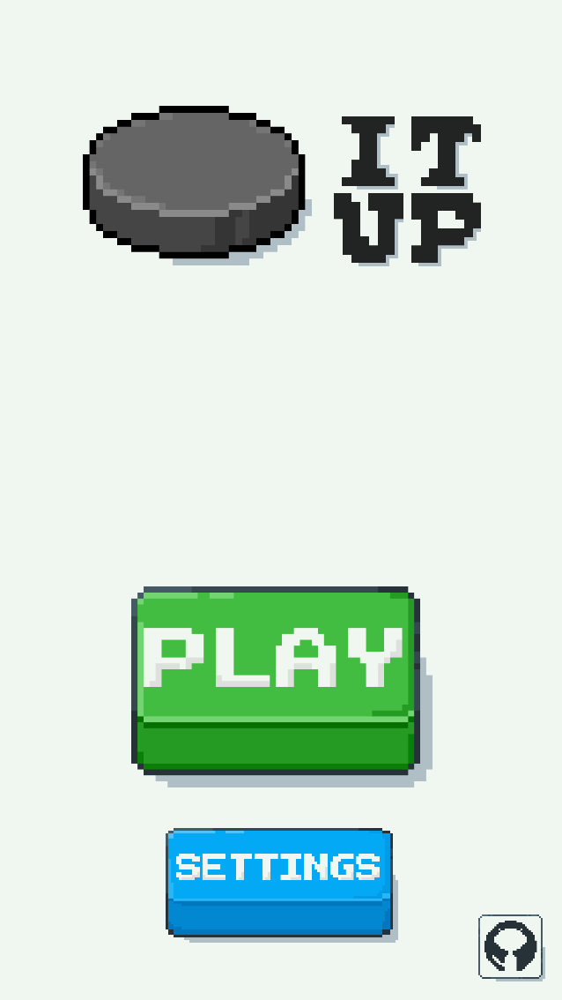

# Puck It Up 🏒

 

---

 

## Overview

`Puck-It-Up` is made by two students from the University of Melbourne, aiming to learn the basics of mobile development.  

The project is written in `Lua`, using the `Solar2d` framework.  

It is currently a work in progress, and aims to set it itself apart from other similar games by including **powerups** on the playing field.  

 

---

 

## Demonstration

A early version of the game can be seen being played [here](https://www.youtube.com/shorts/SoRchPGsBxE).  

Here is a sneakpeek of the homescreen as well. If you have any feedback for us, feel free to create an issue or edit the codebase!  

Enjoy 👍

